# Models Module Architecture

This directory contains the Next.js page components for the Models management feature. The architecture follows the Next.js App Router pattern with a clear separation between server and client components.

## Data Flow Architecture

## Component Responsibilities

1. **Backend Service (`src/backend/services/model/index.ts`)**
   - Handles data persistence (loading/saving models)
   - Manages encryption of sensitive data (API keys)
   - Implements business logic and validation

2. **Server Component (`page.tsx`)**
   - Server-side data fetching using the backend service
   - Provides the page structure and layout
   - Passes initial data to the client component

3. **Client Component (`ModelClient.tsx`)**
   - Acts as the orchestrator for the models page
   - Manages client-side state (models, errors, loading states)
   - Handles all CRUD operations via the frontend service
   - Passes data and callbacks to UI components

4. **UI Components (`src/frontend/components/models/`)**
   - **ModelList**: Renders the grid of model cards
   - **ModelCard**: Displays individual model information
   - **ModelModal**: Complex form for adding/editing models

5. **Frontend Service (`src/frontend/services/model/index.ts`)**
   - Provides an API client for the backend
   - Handles HTTP requests and error handling
   - Formats data for UI consumption

## Files in this Directory

- **page.tsx**: Server component that fetches initial data and provides the page structure
- **ModelClient.tsx**: Client component that manages state and orchestrates UI updates
- **loading.tsx**: Loading state component displayed during initial data fetching
- **error.tsx**: Error boundary component for handling and displaying errors

## Key Interactions

1. **Data Loading Flow**:
   - Server component fetches initial models
   - Data is passed to ModelClient as props
   - ModelClient renders ModelList with this data
   - ModelList renders individual ModelCards

2. **Edit Flow**:
   - User clicks edit on a ModelCard
   - ModelClient updates URL with query parameter
   - ModelModal opens with the selected model data
   - User edits and saves the model
   - ModelClient refreshes the model list

3. **Add Flow**:
   - User clicks "Add Model" button in ModelClient
   - ModelClient creates a preliminary model
   - ModelModal opens with empty fields
   - User completes the form and saves
   - ModelClient refreshes the model list

## Technical Implementation Details

1. **State Management**:
   - ModelClient uses React's useState for global page state
   - ModelModal manages its own form state
   - URL parameters are used for modal visibility state

2. **API Communication**:
   - Frontend service handles all API calls
   - Proper error handling and loading states
   - Encrypted API keys for security

3. **Component Design**:
   - "use client" directive marks client components
   - Server component uses async/await for data fetching
   - UI components are focused on presentation
   - Clear separation of concerns throughout

This architecture demonstrates effective use of Next.js App Router patterns, with server components handling data fetching and client components managing interactivity, while reusable UI components handle presentation.
